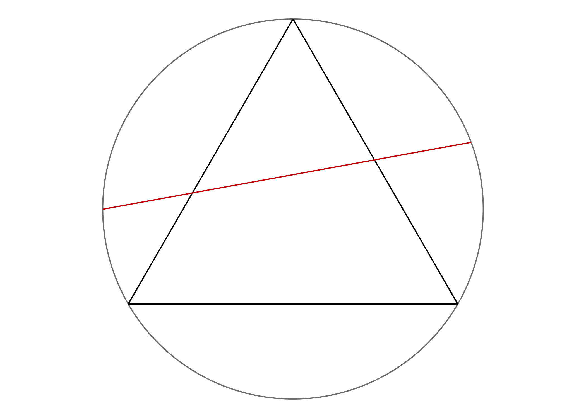

# Betrand's Paradox

The Bertrand paradox is generally presented as follows:

> Consider an equilateral triangle inscribed in a circle.
> Suppose a chord of the circle is chosen at random.
> What is the probability $p$ that the chord is longer than a side of the triangle?

Three different solutions are presented, each hinging on the method of generating the random chord:

- **METHOD A (random endpoints)**: Choose two random points on the circumference of the circle, and draw the chord joining them.

- **METHOD B (random radial points)**: Choose a random radius of the circle, and a random point on this radius, and draw the chord through this point and perpendicular to the radius.

- **METHOD C (random midpoints)**: Choose a point anywhere within the circle, and construct the chord such that the point chosen is the midpoint of the chord.

The three different methods above, all seemingly valid, yield different results for the probability in question! The exact answer can be worked out using geometric reasoning, but the goal of this assignment is to provide a visual and empirical way of calculating the probabilities.

## Instructions

> Objective: Show, using simulation and appropriate visualisations, that the three methods above yield different $p$ values.

As a group, you will write R code in a single .R script (named `solution.R`) that performs the intended solutions. This script should be able to be run without errors.

Consider the following points when writing your solutions:

- You are free to choose the format of your solutions (`print()`, `cat()`, data frames, tibbles, ggplots, writing functions, etc.)--but note that marks are awarded for clarity.

- Comment on your code to make its intention clearer (but don't go overboard!)

- You may split the task among yourselves however you wish, as long as there is a proportional effort from all team members.

- If you wish, you may present your solutions within GitHub (e.g. by appending a new section at the top of this README.md file and/or by using GitHub pages).

## Tips

This assignment assumes some basic knowledge of geometry and simple probability, including but not limited to

- The equation of a circle with radius $r$ centred at $x_0$ and $y_0$ is given by $(x-x_0)^2 + (y-y_0)^2 = r^2$ (assuming a cartesian system of coordinates $(x,y)$ ).

- Basic trigonometry angles such as $\sin \theta$ and $\cos \theta$ and Pythagoras theorem $a^2 + b^2 = c^2$.

- Calculating distance between two points in 2-D space (Euclidean distance).

- The principle of indifference: The probability $\Pr(A)$ of an event $A$ happening is given by the ratio of the number of favourable outcomes to the total number of outcomes in the sample space. That is, in a random experiment, suppose $n(S)$ denotes the total number of outcomes, and $n(A)$ denotes the number of outcomes involving $A$, then $$\Pr(A) = \frac{n(A)}{n(S)}.$$

In addition, you might find R's `runif()` function helpful for random number generation.

